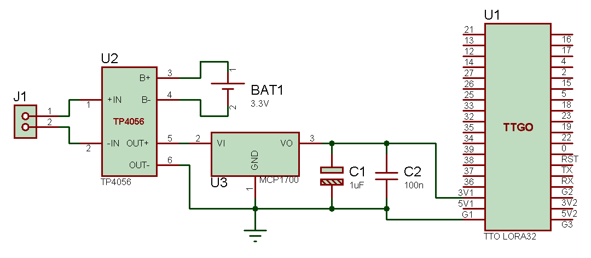
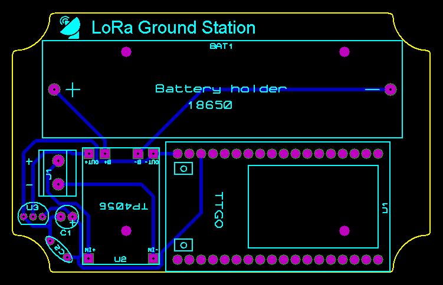

# LoRa Ground Station

Based on the project "Ground station for LoRa satellites" by [alberto nunez](https://hackaday.io/project/186243-ground-station-for-lora-satellites)

Material:
  - TTGO LORA32 ESP32 with OLED
  - RP-SMA flange to U.FL pigtail
  - 433 Mhz antenna SMA
  - Generic 100x68x50mm waterproof enclosure box “Sonoff”
  - SMA Female To RP SMA Male adapter
  - Solar panel
  - 18650 3,7V battery and battery holder
  - TP4056 battery charge manager
  - Female header 2.54mm
  - Screw terminal kf350 3.5mm 2 pin
  - MCP1700-3302E voltage regulator
  - 1uF electrolytic capacitor
  - 100nF film capacitor

Electronic design:
  [Proteus project file](https://github.com/4IM4R/LoRa-Ground-Station/blob/e2a53dc4b7f0d562ad7ddc52352c304cba657683/proteus/LoRa_GS.pdsprj)
  
  Schematic:

  PCB layout:

Software:
  - [TinyGS Firmware](https://github.com/G4lile0/tinyGS)
  - VSCode
  - Platformio

Installation guide:
  - [Install VSCode](https://code.visualstudio.com/download)
  - Download [repository](https://github.com/G4lile0/tinyGS) from Github. Code -> Download ZIP
  - Launch VSCode
  - Install [Platformio in VSCode](https://docs.platformio.org/en/latest/integration/ide/vscode.html)
  - Upload [project to TTGo](https://github.com/G4lile0/tinyGS/wiki/Platformio)
  
Configuration:
  - https://github.com/G4lile0/tinyGS/wiki/Ground-Station-configuration
  
