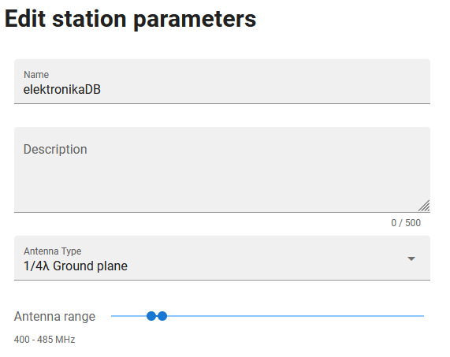

# LoRa Lurreko Estazioa

Proiektu hau honako proiektuetan oinarritua izan da:
  - "Ground station for LoRa satellites" by [alberto nunez](https://hackaday.io/project/186243-ground-station-for-lora-satellites)
  - [TinyGS](https://github.com/G4lile0/tinyGS)
  
Beharrezko materiala:
  - TTGO LORA32 ESP32 433MHz bertsioa
  - 433MHz antena
  - 433MHz banda paseko filtroa
  - 2x SMA kablea arra-arra
  - UHF arra - SMA emea adaptadorea
  - RP-SMA flange to U.FL pigtail (10cm)
  - 100x68x50mm waterproof “Sonoff” kaxa
  - 18650 3,7V pila rekargablea eta pila euskarria
  - TP4056 karga kudeatzailea
  - 2.54mm konektore emea
  - PCB konektorea Screw terminal kf350 3.5mm 2 pin
  - MCP1700-3302E tentsio erregulatzailea
  - 1uF kondentsagailu elektrolitikoa
  - 100nF film kondentsagailua
  - Plaka fotoboltaikoa
  
 

Eguneratu behar da => Electronic design:
  [Proteus project file](https://github.com/4IM4R/LoRa-Ground-Station/blob/e2a53dc4b7f0d562ad7ddc52352c304cba657683/proteus/LoRa_GS.pdsprj)
  
  Eguneratu behar da => Schematic:

  Eguneratu behar da => PCB layout:

Softwarearen insatalazioa:
  - Jarraitu ondorengo estekako [argibideak](https://github.com/G4lile0/tinyGS/wiki/Quick-Start)
  
Konfigurazioa:
  - Jarraitu ondorengo estekako [argibideak](https://github.com/G4lile0/tinyGS/wiki/Ground-Station-configuration)
  - Estazioaren konfigurazioa burutu eta gero, Telegrameko bot pertsonalaren bidez web-login tokena sortu (TinyGS Personal Bot txatean /weblogin idatziz)

  
  - Sortuko den esteka ireki eta bertan ondorengo aldaketak egin:
  - "Edit Station" atalean sartu eta antena mota eta funtzionamendu frenkuentzia eremua aukeratu. Nahi izan ezkero estazioaren argazki bat ere gehitu daiteke. Aldaketak gorde
  

  - "Operate" atalean sartu eta "Auto Tune" atalean Enabled 433 aukeratu (garrantzitsua da estazioak sateliteen seinalea behar bezala jasotzeko). Aldaketak gorde
  

  - Behin aldaketak gorde eta gero, saioa itxi eta hasierako konfigurazioa egin den lekutik (estazioaren IP-a nabigatzailean idatziz), estazioa berrabiaraztea komenigarria da "Restart station" aukeratuz
  

  
  # Antena
 Proiektu hontan egingo den antena uhin laurdeneko ground plane motako antena bat izango da. Antenaren dimentsioak kalkulatzeko, honako [antena kalkultzailea](https://m0ukd.com/calculators/quarter-wave-ground-plane-antenna-calculator/) erabiliko dugu. 433MHz aukeratzen baditugu eta "Calculate My Quarter Wave!" sakatzen badugu, gure antenaren dimentsioak eskuratuko ditugu.
 Gure kasuan A elementu bertikalak 16,5cm eta B elementuek 18,4cm izan behar dituztela ikusiko dugu.
 
 
 
 Antena sortzeko beharrezko materiala:
 - 3mm-ko metalezko hagatxoa (metro bat)
 - 4x terminal borobil
 - Paneleko muntaiarako konektorea UHF emea (SO239) duena
 
 
 
 Montatzeko pausoak
 - Metalezko hagatxoa kalkulatzailean kalkulaturiko tamainako zatietan moztu: A tamainako pieza bat eta B tamainako lau pieza
 - Terminal borobilek plastikozko isolamendua badaukate, kendu
 - B piezetan (luzeetan) puntan terminalak lotu, estainatuz edo krinpatuz
 - Paneleko konektorean, UHF konektorearen bestaldean A pieza lotu, estainatuz
 - B piezak tornillo eta azkoin bidez konektorean lotu
 
 
 
 
 
 # Banda paseko iragazkia
Banda paseko iragazkia 433MHz inguruko frekuentzia duten uhinak pasatzen utziko dituen iragazki bat izango da. Frekuentzia hortatik gora 20Mhz eta behera 20MHz tarteko uhinak ere pasatzen uzteko diseinatuko dugu, beraz, gure filtroak 413-453MHz frekuentzia duten uhinak pasatzen utziko ditu.
 
Montatzeko erreztasunagatik, lehen ordenako filtro pasibo bat sortuko dugu goi-paseko eta behe-paseko bi iragazki seriean lotuz. Behe-paseko filtroak frekuentzia konkretu batetik (gure kasuan 413MHz) beherako uhinak moztuko ditu; goi-paseko filtroak, aldiz, frekuentzia konkretu batetik (gure kasuan 453MHz) gorako uhinak moztuko ditu.

Banda paseko iragazkia osatuko duen iragazki bakoitza erresistentzia eta kondentsagailu batez osaturik egongo da. Honela kalkulatuko ditugu gure iragazkiaren elementuen balioak:
- Behe-paseko filtroa

  Filtroaren mozketa frekuentzia honako formularen bidez kalkulatzen da:
  
\\R=Xc

